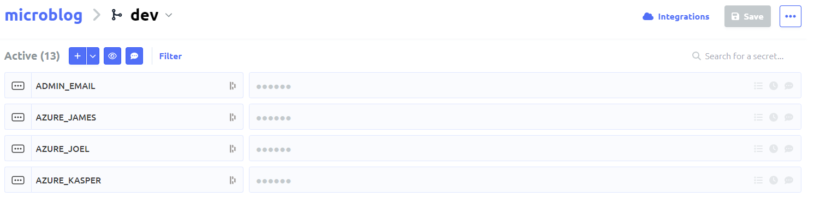
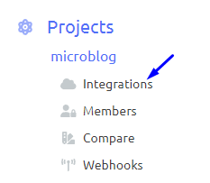
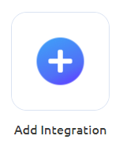
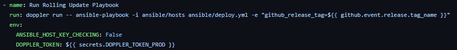
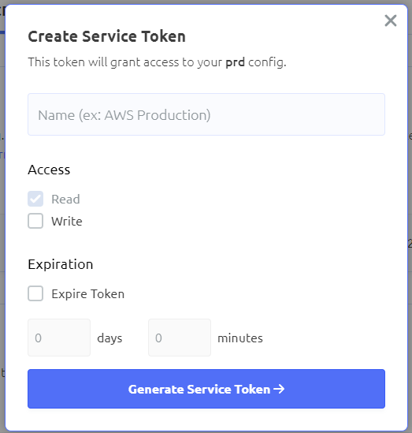

# Technical study about Doppler

## Introduction

If you have a number of environment variables/secrets that need to be managed across different web apps, servers and development environments, Doppler can help. Doppler is used to securely manage information such as API keys, passwords and other configuration data. This creates a unified and centralized place to store all their secrets, giving the entire team easy access.

It is often the case that developers work in different environments such as development, testing and production, which makes it a challenge to ensure that the right configuration is used in their environment. Also, the variables are constantly updated during the development process where the developers can add, edit or delete variables but have forgotten to inform the other developers. This can create problems that you have the wrong env variables or have forgotten to insert a specific one that can make the program not work as it should or that the construction process is not correct.

This is instead automated by using Doppler, which ensures that the correct configuration is used everywhere and reduces the risk of human error, compared to doing this manually. The data is also well encrypted so it is protected against cyber threats.

## Key Features

- **Centralized Secrets Management**: Keep all your environment variables in one place, accessible by the whole team.
- **Environment Specific Configurations**: Define and manage configurations specific to each development, testing, and production environment.
- **Secure Access Control**: Limit access to sensitive information based on roles within your team.
- **Automatic Syncing**: Ensure that all environments are automatically updated with the latest changes to secrets and configurations.
- **Easy Integration**: Doppler seamlessly integrates with most development tools and platforms, making it easy to adopt in your workflow.

## Instructions

### Setting up an account

The first thing you need in order to use doppler is to be a student on GitHub to get the "Team" rank. Otherwise, it costs 18$ per month per user. However, it is possible to use the Developer rank which is free up to 3 people.

### Setting up the project

Once you have created an account, you can set up your project. We call this a microblog. In the project we can create environments. We get 3 defaults which are "Development", "Staging" and "Production". We choose to use the 3 defaults because they fulfill the environments that we use in the microblog. We also add a new environment called Github. There, the secret variables that we want in github will be added, more about this will be discussed under the heading [Integration with Github](#integrering-med-github).

In each environment you can create a branch that inherits secrets from the root configuration. This can be very useful if it looks different from each user who programs in the project. This may be, for example, that we have different resource groups when publishing in azure, different passwords or different ssh keys. These are good to have hidden and that you can easily access your own and then becomes very useful to save this in Doppler.

Inside an environment is where you create secrets. This can be anything from admin emails, ssh and passwords for example. These secrets become variables when you run the doppler command shown below.

### Doppler CLI and integration locally

To integrate Doppler to a project, we first need to install the doppler cli.

- [Installera Doppler cli](https://docs.doppler.com/docs/install-cli)

To then use it in local development, you need to log in to Doppler using the command: `doppler login` in the terminal.

Once you have logged in, you go to the repot you want to connect the doppler to in this case it is microblog report and run the command: `doppler setup` and choose which project and config you want to use. In this case we use microblog which is the project name in doppler and dev which is the development environment. You can also optionally create a `doppler.yaml` in the root of the repository, to configure for use in local development.

After you have logged in and chosen your environment, you can start your application using the command `doppler run -- <start script>` (for example `doppler run -- npm start` ). This will inject all the secrets from doppler into the environment of the program you are starting.

### Integration with Github

To easily add, change and delete secret variables from the different environments and in github, it is very useful to link Doppler with Github. You can choose to have automatic synchronization that directly changes github secrets if something changes in doppler or you can also choose to have manual synchronization and then you need to manually click on sync to get the new updates to github.

We do this by clicking on Integrations in the left corner

and then click on "Add Integration".

You then choose which github repo you want to connect the Doppler project to and which environment you want to use. We chose to use the production environment with the microblog repo. When the github integration has been added, you can check in Secrets in github to see if the variables have been added.

This is what it might look like:

| Here we chose to only put in DOPPLER_CONFIG, DOPPLER_ENVIROMENT, DOPPLER_PROJECT and DOPPLER_TOKEN_PROD that we need in github secrets. The others that are listed as secret variables are those that should not be visible to anyone except the owner of the github project, so as not to accidentally expose passwords for example on Dockerhub in Doppler. This could have been done differently in Doppler by using roles and locking the confidential things that belong to yourself, but in this particular project we can unfortunately not do this now because the three of us working on the project are the owners of Doppler.

### Integration with Github Actions

To be able to inject your environment variables into your ci/cd flow on github, you first need to make sure that your workflow has doppler installed. You do this by adding `uses: dopplerhq/cli-action@v2` to your workflow. After that, you then have access to doppler cli. When you want to inject your variables, you run the same as in the
local environment `doppler run -- <your script/command>`. For example like this:

In order to get access to your secrets, you also need a token because you cannot run `doppler login` as it requires user input. This token is called a **"Service Token"** and can be added under the settings of any of your configs. Under the access tab you can easily create a new one by clicking on **"Generate"**. You can let your token expire after a certain time and add read/write rights. Once this is done, this access token should be sent in the environment when you run your command. See previous image.

## Relation to Devops

An important part of DevOps is the automation and simplification of various processes to speed up reliable deliveries. Since Doppler automates the process of managing environment variables and configuration data in different contexts, it contributes to this process. Doppler provides a centralized location where teams can use common environment variables, facilitating team collaboration. This is an essential part of DevOps. Doppler allows for faster iterations and deployments by making the management of environment variables more efficient, driving towards the DevOps goal of CI/CD (continuous integration and continuous deployment).

### Management of ENV and Configuration

Doppler's role is to simplify the management of environment variables (ENV) and configuration data. Because Doppler centralizes the variables, it eliminates the need to spread them out across multiple files and systems. This creates a much easier way to track these variables.

Traditionally, updating environmental variables can be a slow and time-consuming process. However, Doppler automates and simplifies this process, enabling developers to quickly implement changes and ensure they are immediately propagated to all relevant environments.

### Integration support

Doppler supports integration with a wide range of tools and platforms. Because of this, environment variables can be managed regardless of the technology stack, allowing Doppler to fit in with many different DevOps ecosystems. This includes CI/CD tools, container technologies like kubernetes and Docker, as well as some programming languages and frameworks.

### Safety and security

Doppler contributes to the security of sensitive environmental variables and configuration data. Centralized storage reduces the risk of potentially insecure storage of these variables. Doppler offers a secure location with low risk of unauthorized access and data breach. All data stored at Doppler is protected by strong encryption, ensuring the security of both storage and transmission. Access to various resources can be managed by the organization, ensuring that only authorized members have access to sensitive information.

## Conclusion

Doppler is simple and easy to use and set up. It simplifies and speeds up the configuration of secrets and environments and keeps them consistent between environments and with good possibilities for personal variables.

We ourselves found this very useful to learn and will definitely bring this to future projects.

== **8/10 Seagulls** ==
