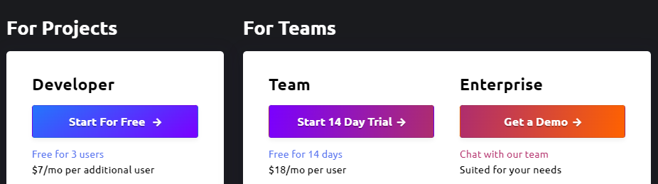
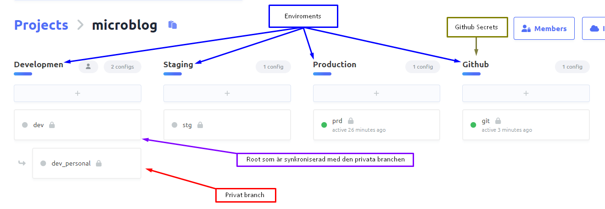
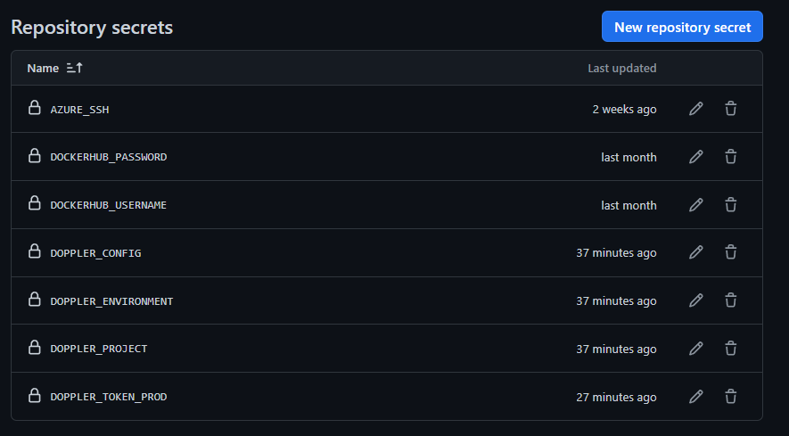

# Teknisk studie om Doppler

## Introduktion

Om man har ett antal miljövariabler/secrets som behöver hanteras över olika webbappar, servrar och utvecklingsmiljöer, så kan Doppler hjälpa till. Doppler används för att säkert hantera information som API-nycklar, lösenord och andra konfigurationsdata. Detta skapar en enhetlig och centraliserad plats för att förvara alla sina secrets vilket ger hela teamet enkel åtkomst.

Det är ofta att som utvecklare att jobba i olika miljöer som utveckling, testning och produktion vilket gör de till en utmaning att hantera att rätt konfiguration används i sin miljö. Även så uppdateras variablerna hela tiden under utvecklingsprocessen där utvecklarna kan bland annat lägga till env variabler, redigera eller ta bort men har glömt att informera detta till de andra utvecklarna. Detta kan skapa problem att man har fel env variabler eller har glömt sätta in någon specifik som kan göra att programmet inte funkar som det ska eller att byggprocessen inte blir rätt.

Detta blir i stället automatiserat genom att använda sig utav Doppler vilket ser till att rätt konfiguration används överallt och minskar risken för mänskliga fel, jämfört med om man skulle göra detta manuellt. Data är dessutom väl krypterat så det är skyddat mot cyberhot.

## Instruktioner

### Sätta upp konto

Det första man behöver för att kunna använda doppler är att vara student på GitHub för att få "Team" ranken. Annars kostar den 18$ per månad per användare. Det går dock att använda Developer ranken som är gratis upp till 3 personer.

### Sätta upp projektet

När man väl har skapat ett konto så kan man sätta upp sitt projekt. Vi döper detta till microblog. I projektet så kan vi skapa enviroments. Vi får 3 defaults som är "Development", "Staging" och "Production". Vi väljer att använda de 3 defaults för att de uppfyller de enviroments som vi använder oss utav i microblogen. Vi lägger även till en ny enviroment som heter Github. Där kommer de secrets variablerna som vi vill ha in i github läggas till, mer om detta kommer att tas upp under rubriken [Integrering med Github](#integrering-med-github).

I varje enviroment kan man skapa en branch som ärver hemligheter från rotkonfigurationen. Detta kan vara väldigt användbart om det ser olikt ut från varje användare som programmerar i projektet. Detta kan vara exempelvis att vi har olika resource groups vid publicering i azure, olika lösenord eller olika ssh nycklar. Dessa är bra att ha gömda samt att man lätt kan komma åt sin egen och blir då väldigt användbart att spara detta i Doppler.

Inuti en enviroment är platsen man skapar secrets. Detta kan allt vara från admin email, ssh och lössenord exempelvis. Dessa secrets blir till env variablar när man kör doppler kommandot som visas längre ner.

### Doppler CLI och integrering med Microblog lokalt

För att integrera detta Doppler projekt med Microblog behöver vi först installera doppler cli.

- [Installera Doppler cli](https://docs.doppler.com/docs/install-cli)

För att sedan använda det inom lokal utveckling så behöver man logga in på Doppler genon kommandot: `doppler login` i terminalen.

När man väl har loggat in så går du in på det repot du vill koppla dopplern till i detta fallet är det microblog report och kör kommandot: `doppler setup` och välja vilket projekt och config man vill använda sig utav. I detta fallet använder vi microblog som är projekt namnet i doppler och dev som är development enviromentet. Man kan även valfrit skapa en `doppler.yaml` i roten av förvarvet, för att konfigurera för användning för lokal utveckling.

Efter man har loggat in och valt sin miljö så kan man start upp sin applikation med hjälp utav kommandot `doppler run -- <start script>` (exempelvis `doppler run -- npm start` ). Detta injekterar alla secrets från doppler till environment utav det programmet du startar upp.

### Integrering med Github

Att lätt kunna lägga till, ändra och ta bort secret variabler från de olika enviroments samt i github så är det väldigt användbart att koppla Doppler med Github. Man kan välja att ha automatisk synkronisering som ändrar direkt github secrets om något ändras i doppler eller så kan också välja att ha manuell synkronisering och då behöver man manuellt klicka på att synka för att få ner de nya uppdateringarna till github.

Vi gör detta genom att klicka på Integrations i vänstra hörnet

och sedan klicka på "Add Integration".

Man väljer sedan vilket github repo man vill koppla Doppler projektet till och vilken enviroment man vill använda sig utav. Vi valde att använda oss utav produktions enviroment med microblog repot. När github integrationen har lagt till så kan man kolla i Secrets i github för att se om variablerna har blivit tillagda.

Såhär kan det se ut:

| _Här valde vi att bara sätta in DOPPLER_CONFIG, DOPPLER_ENVIROMENT, DOPPLER_PROJECT och DOPPLER_TOKEN_PROD som vi behöver i github secrets. De andra som står med som secret variabler är de som inte ska synas för någon förutom ägaren till github projektet, för att inte råka exponera lössenord exempelvis på Dockerhub i Doppler. Detta hade kunnat gjorts olikt i Doppler med att använda sig utav roller och låsa de konfidentiella sakerna som tillhör en själv men i just detta projektet kan vi tyvär inte göra detta nu pågrund av att vi tre som jobbar på projektet står som ägare på Doppler._ |

### Integration med Github Actions

För att kunna injektera din environment variabler i ditt ci/cd flöde på github, så behöver du först se till att ditt workflow har installerat doppler. Detta gör du genom att lägga till `uses: dopplerhq/cli-action@v2` i ditt workflow. Efter det så har du sedan tillgång till doppler cli. När du sen ska injektera dina variabler så kör du likadant som i den
lokala miljön `doppler run -- <ditt skript/kommando>`. Till exempel såhär:

För att du ska kunna få tillgång till dina secrets behöver du också en token eftersom du inte kan köra `doppler login` då det kräver användar input. Denna token kallas för en **"Service Token"** och går att lägga till under inställningarna för någon utav dina configs. Under fliken access kan du enkelt skapa en ny genom att klicka på **"Generate"**. Du kan låta din token vara gå ut efter en viss tid samt lägga till read/write rättigheter. När detta sen är gjort ska denna access token skickas med i environment när du kör ditt kommando. Se förra bild.

## Relatering till Devops

En viktig del av DevOps är automatisering och förenkling av olika processer för att öka hastigheten på pålitliga leveranser. Eftersom Doppler automatiserar processen att hantera miljövariabler och konfigurationsdata i olika sammanhang, bidrar det till denna process. Doppler erbjuder en centraliserad plats där team kan använda gemensamma miljövariabler, vilket underlättar samarbetet i teamet. Detta är en väsentlig del av DevOps. Doppler tillåter snabbare iterationer och deployments genom att göra hanteringen av miljövariabler mer effektiv, vilket driver mot DevOps-målet om CI/CD (kontinuerlig integration och kontinuerlig deployment).

### Hantering av ENV och Konfiguration

Dopplers roll är att förenkla hanteringen av miljövariabler (ENV) och konfigurationsdata. Eftersom Doppler centralisera variablerna så eliminera detta behov att sprida ut dem över flera filer och system. Detta skapar ett mycket enklare sätt att spåra dessa variabler.

Traditionellt sett kan uppdatering av miljövariabler vara en trög och tidskrävande process. Doppler automatiserar och förenklar dock denna process, vilket möjliggör för utvecklare att snabbt genomföra ändringar och säkerställa att de omedelbart sprids till alla relevanta miljöer.

### Integrationsstöd

Doppler stödjer integration med ett stort utbud av verktyg och plattformar. På grund av detta kan man hantera miljövariabler oavsett teknisk stack vilket tillåter Doppler att passa in bland många olika DevOps-ekosystem. Detta inkludera CI/CD-verktyg, container-teknologier som kubernetes och Docker, samt en del programmeringspråkoch och ramverk.

### Säkerhet

Doppler bidrar till säkerheten för känsliga miljövariabler och konfigurationsdata. Centraliserad lagring minskar risken för potentiellt osäker förvaring av dessa variabler. Doppler erbjuder en säker plats med låg risk för obehörig åtkomst och dataintrång. All data som förvaras på Doppler är skyddad med stark kryptering, vilket garanterar säkerheten vid såväl lagring som överföring. Åtkomsten till olika resurser kan hanteras av organisationen, vilket säkerställer att endast auktoriserade medlemmar har tillgång till känslig information.

## Slutsats

Doppler är enkelt och smidigt att både använda och sätta upp. Det förenklar och snabbar upp konfiguration av secrets och environments och håller dom konsistent mellan miljöer och med bra möjlighet till personliga variabler.

Vi tycker själva att detta var väldigt användbart att lära oss och kommer definitivt ta med detta till framtida projekt.

== **8/10 Fiskmåsar** ==
